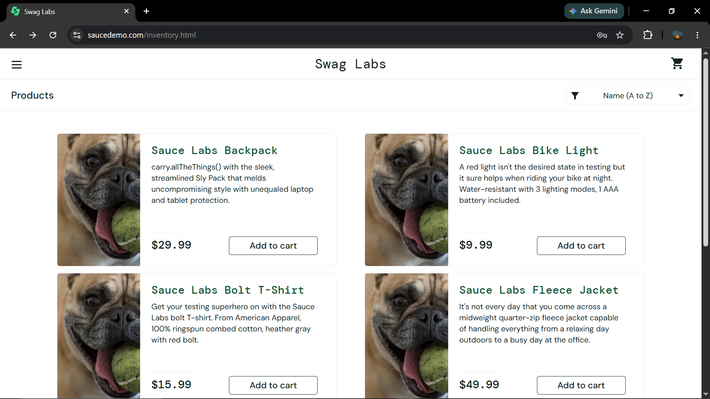
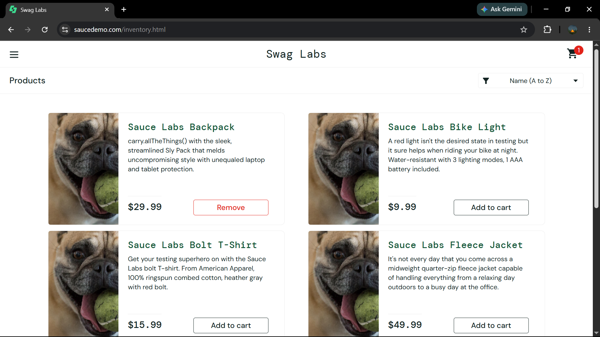

# Bug Report

## BUG-001 — Product Image Tidak Sesuai

| Field | Detail |
|---|---|
| Bug ID | BUG-001 |
| Test Case ID | TC-PROD-004 |
| Module | Product |
| Title | Gambar produk tidak sesuai dengan produk pada `problem_user` |
| Environment | Windows 10, Google Chrome 152 |
| Test Account | `problem_user` |
| Severity | Medium |
| Priority | Medium |
| Status | Open |

### Preconditions

1. Pengguna berada pada halaman login SauceDemo.
2. Akun `problem_user` tersedia.
3. Browser menggunakan Google Chrome 152.

### Test Data

`Username: problem_user`
`Password: secret_sauce`
### Lampiran

---

## BUG-002 — Sorting Name A-Z Tidak Sesuai

| Field | Detail |
|---|---|
| Bug ID | BUG-002 |
| Test Case ID | TC-CART-003 |
| Module | Carting |
| Title | Button Remove tidak dapat menghapus produk pada `problem_user` |
| Environment | Windows 10, Google Chrome 152 |
| Test Account | `problem_user` |
| Severity | Medium |
| Priority | Medium |
| Status | Open |

### Preconditions

1. Pengguna berada pada halaman login SauceDemo.
2. Akun `problem_user` tersedia.
3. Browser menggunakan Google Chrome 152.

### Test Data

`Username: problem_user`
`Password: secret_sauce`
`Product: Sauce Labs Backpack`
`Action: Add to cart → Remove`

---

### Lampiran

# Bug Summary

| Bug ID | Module | Severity | Priority | Status |
|---|---|---|---|---|
| BUG-001 | Product | Medium | Medium | Open |
| BUG-002 | Product Sorting | Medium | Medium | Open |

## Total Bug

- Total Bug: 2
- Open: 2
- Closed: 0
